# Predicting and Forecasting Serious Collisions in NYC

by Manlai Amarsaikhan

## Problem Statement

Through NYPD, the New York City makes datasets on motor vehicle collisions from 2012 on public via Open Data portal. In these datasets, the location, time, damage, number of injuries, deaths, vehicle type, etc. tens of features are collected.

(a) Given a variety of features including time, location and vehicle damage, can we predict whether a passenger was injured or died in a collision?

(b) Is it possible to forecast weekly total number of collisions where a passenger was injured or died?

## Data

### Data Collection

- Motor Vehicle Collisions - Crashes. This dataset contains records of collisions in NYC between January 2012 and December 2022.

- Motor Vehicle Collisions - Vehicles. This dataset contains records of vehicles in NYC that collided with another person/object.

- Motor Vehicle Collisions - Person. This dataset contains records of people who were present during a collision in NYC.

Given that they come from the same authority, these datasets are related. The relational schema between these datasets is as follows:

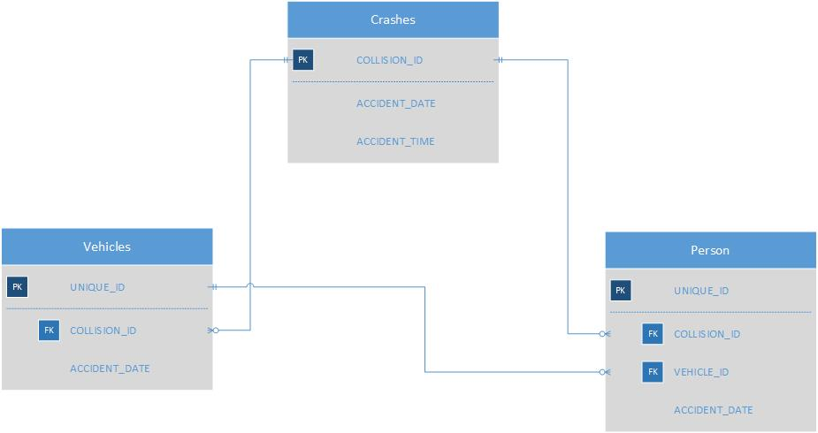

- The collected datasets are not in this repository; however, the processed versions of them are placed in this repository's [data/processed_data](./data/processed_data/) folder.

### Data Cleaning

- The three datasets were merged on the common keys, namely, `Collision Id`, `Crash date` and `Crash time`.

- Given that a collision may include multiple vehicles, there were multiple columns of similar data such as Contributing Factor, Vehicle Type, Vehicle Damage where each column corresponded to a different vehicle. Some of these columns were missing a lot values. These columns were combined into a single column and the rest were dropped.

- Certain columns such as `Public Property Damage` were missing >95% observations, so these were dropped as well.

- Since location is an important feature to explore in this study, any observations missing Latitude and Longitude data were dropped.

---

### Exploratory Data Analysis

- It was hypothesized that 

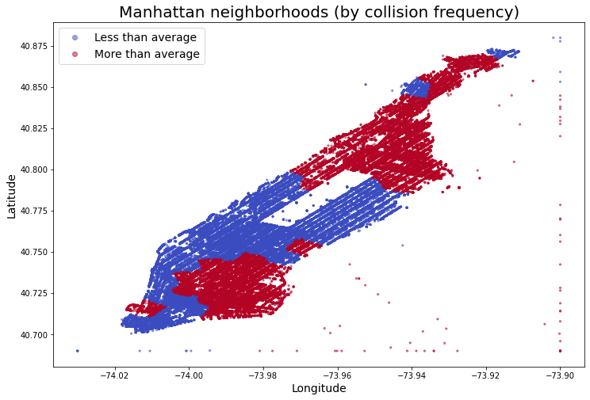

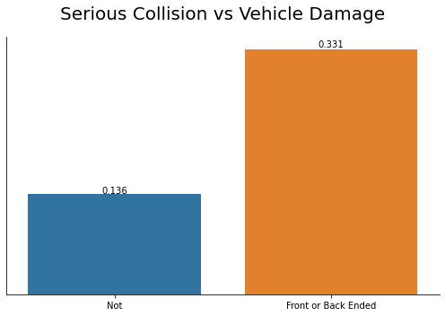
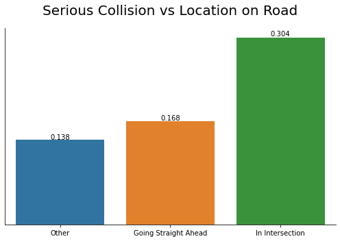
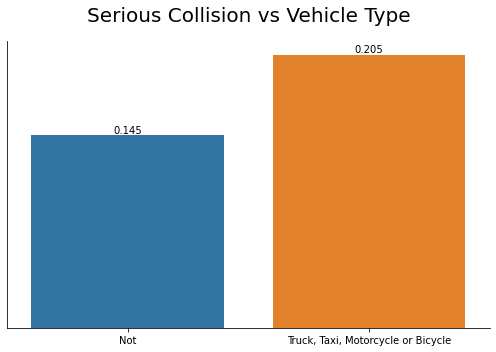

## Feature Engineering

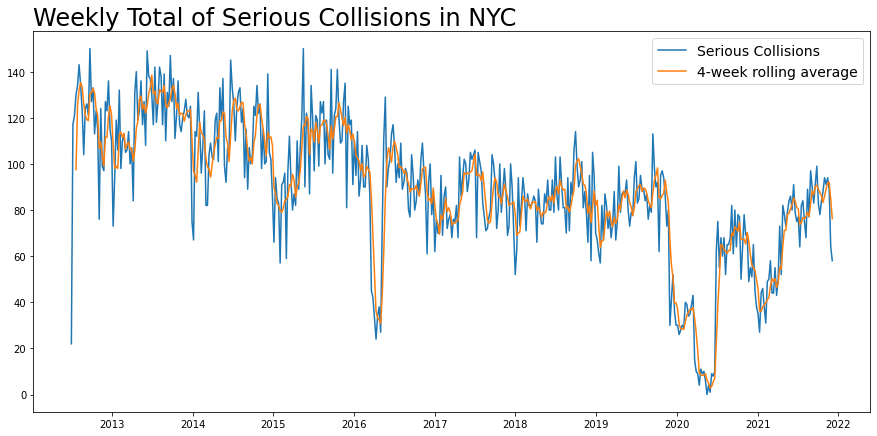
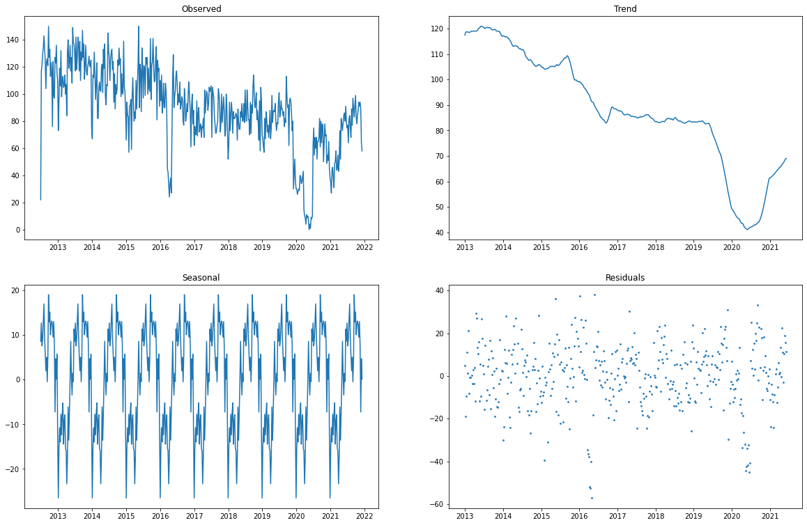
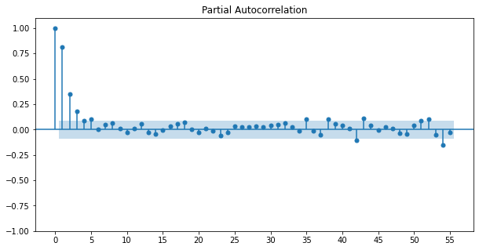

---

## Classifying Serious Collisions

### First Pass

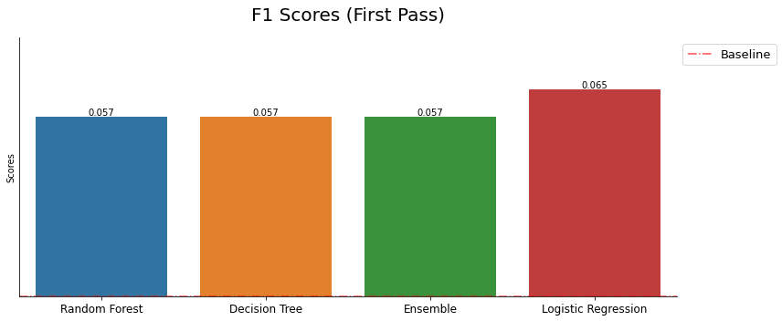

The notebook of this model is placed in this repository's [code/](./code/4-first-pass.ipynb) folder.

### Second Try

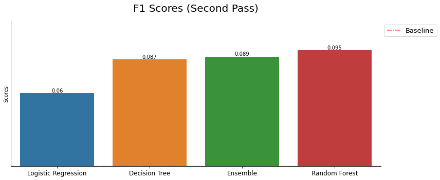

The notebook of this set of models is placed in this repository's [code/](./code/5-second-model.ipynb) folder.

### Third Try

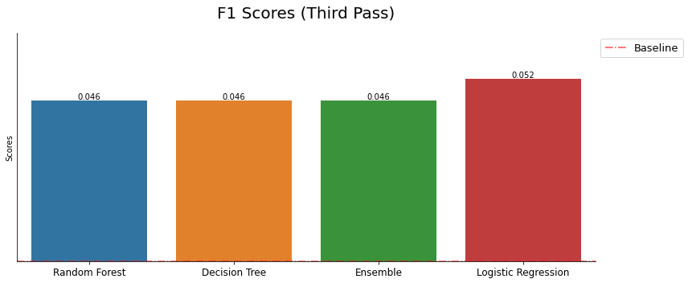

The notebook of this set of models is placed in this repository's [code/](./code/6-third-model.ipynb) folder.

### Fourth Pass: Over/Under Sampling the Minority Class

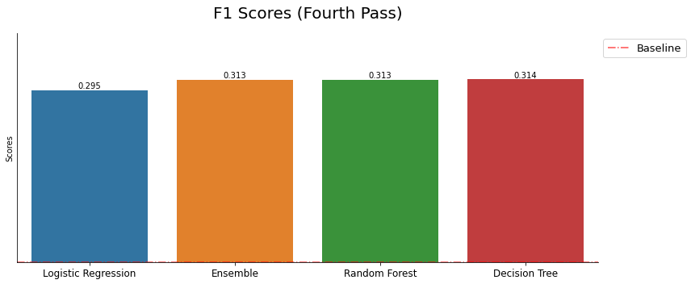

The notebook of this set of models is placed in this repository's [code/](./code/7-fourth-model.ipynb) folder.

---

## Forecasting Weekly Total Number of Serious Collisions

## First Model: OLS

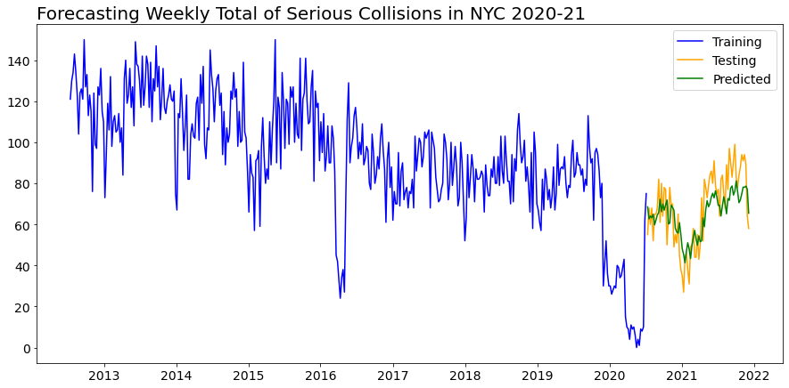

The notebook of this set of models is placed in this repository's [code/](./code/8-time-series-ols.ipynb) folder.

## Second Model: LSTM

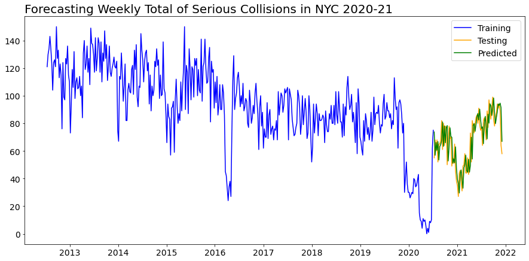

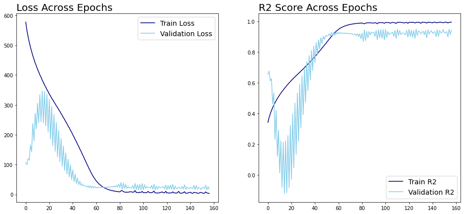
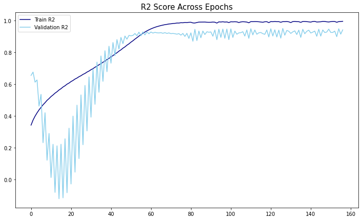

The notebook of this set of models is placed in this repository's [code/](./code/10-lstm.ipynb) folder.

---

## Conclusion

