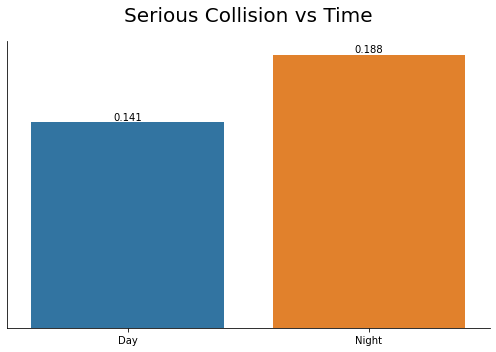
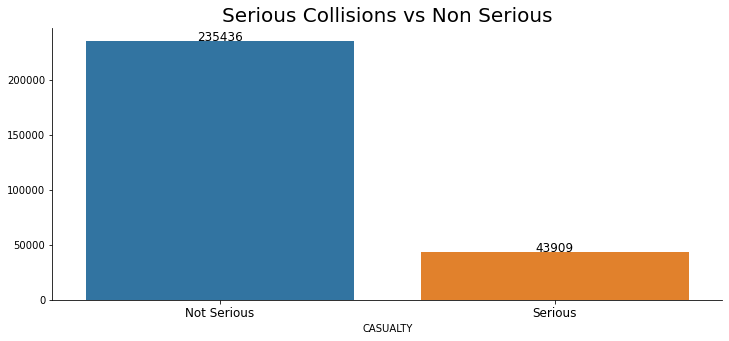

# Predicting and Forecasting Serious Collisions in NYC

by Manlai Amarsaikhan

## Problem Statement

Through NYPD, the New York City makes datasets on motor vehicle collisions from 2012 on public via Open Data portal. In these datasets, the location, time, damage, number of injuries, deaths, vehicle type, etc. tens of features are collected.

(a) Given a variety of features including time, location and vehicle damage, can we predict whether a passenger was injured or died in a collision?

(b) Is it possible to forecast weekly total number of collisions where a passenger was injured or died?


## Data

### Data Collection

- Motor Vehicle Collisions - Crashes. This dataset contains records of collisions in NYC between January 2012 and December 2022.

- Motor Vehicle Collisions - Vehicles. This dataset contains records of vehicles in NYC that collided with another person/object.

- Motor Vehicle Collisions - Person. This dataset contains records of people who were present during a collision in NYC.

Given that they come from the same authority, these datasets are related. The relational schema between these datasets is as follows:


- The collected datasets are not in this repository; however, the processed versions of them are placed in this repository's [data/processed_data](./data/processed_data/) folder.

### Data Cleaning

- The three datasets were merged on the common keys, namely, `Collision Id`, `Crash date` and `Crash time`.

- Since the datasets were pretty massive (each with over 1.7 million observations), only the data for Manhattan was used.

- Given that a collision may include multiple vehicles, there were multiple columns of similar data such as Contributing Factor, Vehicle Type, Vehicle Damage where each column corresponded to a different vehicle. Some of these columns were missing a lot values. These columns were combined into a single column and the rest were dropped.

- Certain columns such as `Public Property Damage` were missing >95% observations, so these were dropped as well.

- Since location is an important feature to explore in this study, any observations missing Latitude and Longitude data were dropped.

- After the above procedure, the remaining dataframe was of shape `(558724, 51)`. It was necessary to drop redundant columns and it was necessary to perform EDA to determine which columns were surplus and which were not.


---


### Exploratory Data Analysis and Feature Engineering

- First of all, the target variable of the classification problem was constructed. The dataset contained the following for each observation:

    - Number of persons injured
    - Number of persons killed
    - Number of pedestrians injured
    - Number of pedestrians killed
    - Number of cyclists injured
    - Number of cyclists killed
    - Number of motorists injured
    - Number of motorists killed

  All of them used to create a binary `Serious Collision` column. In other words, a collision was deemed _"serious"_ if any person was injured or killed as a result of it.

  The aim of the first half of the project is to predict these collisions.

- There were many columns that explain the severity of a collision. Examples include `Contributing Factor`, `Vehicle Damage`, `Vehicle Type`, `State Registration`, `Driver License` etc. All of them were explored to see if there were any significant correlation between them and `Serious Collision`.

  The following plots show some of the highlights. The y-axis indicates the average number of `Serious Collisions` of each category. `Vehicle Damage`, `Location of Road`, `Vehicle Type`, `Time of Day` were all categorical variables that needed to be dummified. A judgment call was made to combine certain dummy values into one. For example, each of the vehicle being a truck, taxi or a motor vehicle was correlated with higher `Serious Collision`. They were combined into a single value.

  <p>
  
  
  </p>
  <p>
  
  
  </p>

  These plots were created in this repository's [code/3-plots.ipynb](./code/3-plots.ipynb) notebook and the analysis was done in the [code/](./code/1-basic-eda.ipynb) notebook.


- To have a single observation for each collision, the data was grouped by `Collision Id` and the maximum value of each group was selected. Each column acts like a flag, so the group by was selecting all True flags, e.g. if a serious collision occurred when one car was making a left turn and another was standing still, it would be flagged because the collision must have at an intersection because one of vehicles were in one.

- Finally, the data is very imbalanced:

  

### EDA: Clustering

Another interesting feature engineered into existence is neighborhood. Manhattan has 84 neighborhoods, so the latitude and longitude data was fitted into a KMeans clustering algorithm to create 84 clusters and the result is as follows:


The clustering was binarized into ones where serious collision occurred more than the average and less then the average. The result looks as follows:


The initial clustering (and its plot) were created in this repository's [code/2-clustering.ipynb](./code/2-clustering.ipynb) notebook and binarized clustering (and its plot) were created in this repo's [code/binary-cluster](./code/5.5-binary-cluster.ipynb) notebook.


After EDA, the dataframe was of shape `(279345, 7)` with columns:
   - `Is Night`, `Front or back ended`, `Going straight ahead`, `In intersection`, `Truck, taxi or bike`, `Cluster` and `Serious Collision`.

### EDA: Weekly Total of Serious Collisions

The second half of this project deals with forecasting weekly total of serious collisions. Towards that end, the data was plotted as follows:


To see if there were any seasonality or trend in the data, seasonal decomposition was also plotted.


As the plot shows, there is a general downward trend in the weekly total of serious collisions and there is a very clear seasonality as well. 


As the data shows trend, partial autocorrelation was plotted to see how many lags were significant. As the lot shows the first 3 lags were significant.

---

## Classifying Serious Collisions

Since we are interested in `Serious Collisions` and do not care about non-serious collisions, F1-score was chosen as the metric to evaluate the model performances. Both precision and recall were deemed important.

In every one these passes, the following 4 models were trained:

- Logistic Regression
- Random Forest
- Decision Tree
- Ensemble of the above three

### First Pass: Only Dummy Variables

The first set of models were trained on `Front or Back Ended`, `Going Straight Ahead`, `In Intersection`, `Truck, Taxi or Bike`. The F1-score comparisons are shown below.


As very minimal features were used, the results also were not good. It was necessary to add more features.

The notebook of this model is placed in this repository's [code/](./code/4-first-pass.ipynb) folder.


### Second Try: Enter Neighborhoods

The second tries were trained on all of the features in the First Try as well as the clusters/neighborhoods dummified into separate columns. The F1-score comparison is as follows:


The results are better than the first try but still not very good. Notably, these models were very slow to train because the training dataset was huge (have 83 more columns than the one in First Try).

The notebook of this set of models is placed in this repository's [code/](./code/5-second-model.ipynb) folder.

### Third Pass: Night Is Not Important

On the third try, even though EDA showed that nighttime collisions were more often serious than daytime collisions, it wasn't reflected in model performances.


As the results show, this model performs the same (even marginally worse than)  as the first try. 

The notebook of this set of models is placed in this repository's [code/](./code/6-third-model.ipynb) folder.

### Fourth Pass: Over/Under Sampling the Minority Class

On the fourth try, since the data is very imbalanced, the minority class was oversampled and the majority class was undersampled. Specifically, the following strategy was used:

  - Borderline Synthetic Minority Over-sampling Technique to oversample the minority class to be 40% of the majority class
  - Random Under Sampler to undersample the majority class to make it twice as large as the minority class.

The performance improved a lot compared to the previous models.


The notebook of this set of models is placed in this repository's [code/](./code/7-over-under-sampled.ipynb) folder.

---

## Forecasting Weekly Total Number of Serious Collisions

### First Model: OLS

Given the results of the PACF plot in the EDA section, as a first pass, the following OLS model was trained:

$$Y_t = \beta_0 + \beta_1Y_{t-1} + \beta_2Y_{t-2} + I_{covid} + t$$

The resulting model had R2 score of 0.719. The forecast plot is shown below.


The notebook of this model is placed in this repository's [code/](./code/8-time-series-ols.ipynb) folder.

### Second Model: LSTM

The final model was a LSTM neural network with the following architecture:

```_________________________________________________________________
 Layer (type)                Output Shape              Param #   
=================================================================
 lstm (LSTM)                 (None, 2, 128)            68096     
                                                                 
 lstm_1 (LSTM)               (None, 32)                20608     
                                                                 
 dense (Dense)               (None, 32)                1056      
                                                                 
 dense_1 (Dense)             (None, 1)                 33        
```
This model builds on the insight gained from the previous model (and PACF plot) and only defines a sequence length of 2. It was prepared to be trained for 200 epochs with early stopping but it stopped at 157 epochs.

The performed very well: 

  - Train Loss: 3.37, Validation Loss: 17.75
  - Train R2 Score: 0.996, Validation R2 Score: 0.946


The forecast looks as follows:


The notebook of this model is placed in this repository's [code/](./code/10-lstm.ipynb) folder.


---

## Conclusion

The first half of this project endeavored to classify serious collisions in Manhattan, New York City using location, vehicle type, damaged part on the vehicle and the location on the road. Due to very few features, the model performances were not good but using resampling techniques, a more respectable score was reached. 

Then the focus was shifted to forecasting the weekly total number of serious collisions and two models were tested: OLS and LSTM. Both models performed better than the classification of individual collisions but LSTM performed much better than OLS.

In this project, a collision is either serious or not; in other words, the target was a binary variable. In interesting project may be to predict the number of serious injuries or deaths in each collision. Since the number of people cannot be a decimal, its prediction would require a more elaborate model.